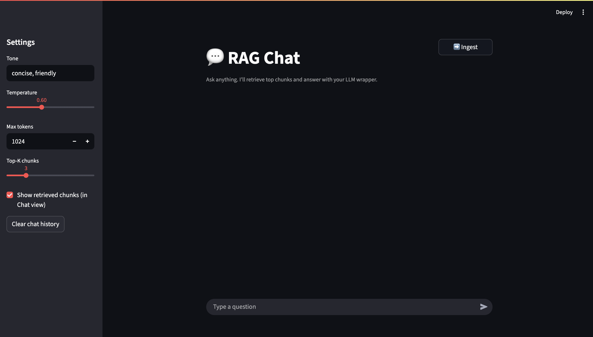

<p align="center">
  
</p>

<h1 align="center">FinChat – Trader’s Assistant</h1>
<p align="center">
  Retrieval-Augmented Chat for traders with YouTube transcript ingestion.
</p>

<p align="center">
  <a href="https://github.com/Rohitg9234/FinChat-Trader-s-Assistant/stargazers"></a>
  <a href="https://github.com/Rohitg9234FinChat-Trader-s-Assistant/actions"></a>
  
  
  
</p>

---

## ✨ What it does
- 💬 **Chat** with a retrieval-augmented assistant on your finance knowledge base.
- 🎥 **Ingest** YouTube channels/playlists/videos → transcribe (Whisper) → embed → query.
- ⚙️ Tune **tone, temperature, tokens, top-k** in the sidebar.
- 🧠 **Caching** so your embedding store loads once per session.
- 🔐 `.env`-based secrets (not committed) + example config.

<p align="center">
  
</p>

---

## 🚀 Quickstart

```bash
# 1) Clone & enter
git clone https://github.com/Rohitg9234/FinChat-Trader-s-Assistant.git
cd FinChat-Trader-s-Assistant

# 2) Conda env (Python 3.11)
conda create -n trade python=3.11 -y
conda activate trade

# 3) Install
python -m pip install -r requirements.txt

# 4) Configure secrets
cp .envexample .env
# edit .env with your keys

# 5) Run
streamlit run app.py
